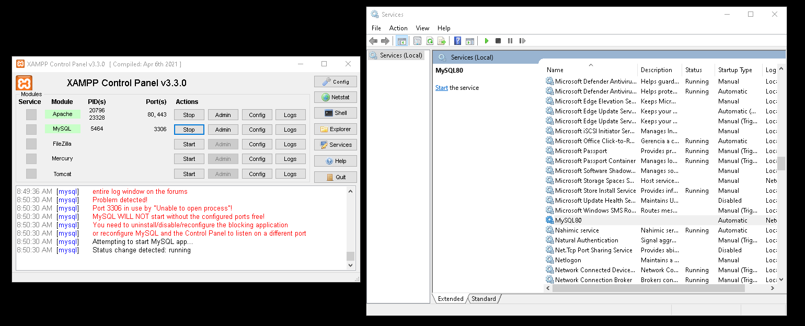

# PHP_studies

- with XAMPP!


## SETUP

Currently, we need to run services and stop MySQL80 before attempting to set the connection through XAMPP's Control Panel. Apache runs fine though.
<p align="center"></p>

## Technologies

- Python 3.8.3
	- Pandas 1.4.4
	- Numpy 1.20.3
	- Pycaret 2.3.10
	- Seaborn 0.11.2
	- Matplotlib 3.5.3
	- Scikit-learn 1.1

---

- Folder copy in XAMPP/htdocs/demo/
- Access through http://localhost/demo/Course_Exercise_Files/demo/

---

## Exercise 2

**Step 1: Make 2 variables called number1 and number2 and set 1 to value 10 and the other 20:**

$number1 = 10;
$number2 = 20;

**Step 2: Add the two variables and display the sum with echo:**

echo "$number1 + $number2 is " . $number1 + $number2 . "<br>"; //the break line is just good form since we have more stuff coming next

**Step3: Make 2 Arrays with the same values, one regular and the other associative**

- associative arrays are kinds that dont need to be ordered. They are called by labels.
	- $number = array(10, 20, 49); # this is an ordered array
	- print_r($number);
	- $names = array("first_name" => "Edwin", "last_name" => "Dias"); # this is associate array. We changed the key from the standard 0 to "first_name"! In a way it's like a dictionary I guess.

```
		$listA = array(23,24,4324,231,424);//common array

		$listB = array('number' => 23) ;//associative array

		echo $listA[0] . "<br>"; //will only work if we are selecting a single list, otherwise we need a print_r

		echo $listB['number'] . "<br>";
```

## If statements are super important

```
if(4 == "4"){ \\ equal to...
    echo "4 is equal to '4'. It is known, muad'dib";

}

if(4 === "4"){ \\ identical to...
    echo "nah, muad'dib";

}
```

- This makes all the difference. == works between data types. === does not

---

## IF statements VS Switches:

// $number = 4;

// if($number < 10){

//     echo "this"; // will yield true and print "this"

// }

$number2 = 47;

// switches are useful when testing one condition against multiple values
switch($number2){

    case 34:
        echo "it is 34";
        break;
    case 47:
        echo "it is 47";
        break;
    case 88:
        echo "it is 88";
        break;
    default:
        echo"we could not find anything";
        break;
}

---

## While Loops

<?php

// pure while syntax

$i = 0; // a counter

while($i < 10){

    $i += 1;
    echo "Our counter is $i" . "<br>";

}

?>

---

## For Loops

<?php

for($i = 0; $i < 10; $i++){ // initialize the counter inside the loop itself | then test the condition | THEN increment

    echo $i . "<br>";

}

    echo "we are out of the loop now!";

?>

---

## Foreach Loops

- works only with arrays. The loop will go through the whole array.

<?php

$numbers = array(10,20,30,40,50,60);

foreach($numbers as $number){ // $numbers is the array. $number will incorporate each element.

    echo $number . "<br>";

}

?>

---